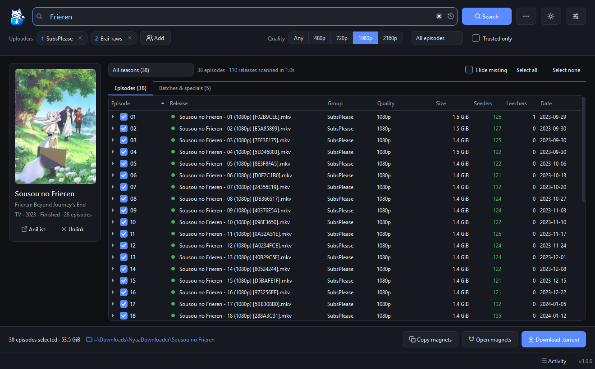
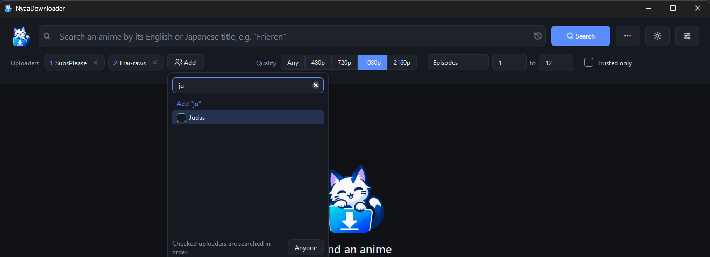

<div align="center">


# NyaaDownloader

**A whole season of anime from Nyaa, in three clicks.**

Type a title, tick the episodes, grab the torrents. NyaaDownloader finds the right release for every episode for you.

[](https://github.com/marcpinet/nyaadownloader/releases/latest)
[](https://github.com/marcpinet/nyaadownloader/actions/workflows/release.yml)
[](https://github.com/marcpinet/nyaadownloader/releases)
[](LICENSE)

<br>

<a href="https://github.com/marcpinet/nyaadownloader/releases/latest">
  
</a>

<sub>Single file · No installation · No Python required</sub>

</div>

<br>

https://github.com/user-attachments/assets/69916a68-4f74-48db-a406-178ebe88d553

<p align="center">
  <picture>
    <source media="(prefers-color-scheme: light)" srcset="docs/screenshots/results-light.png">
    
  </picture>
</p>

## ✨ Why you'll like it

<table>
  <tr>
    <td width="33%" valign="top">
      <h3>🔎 Type the title you know</h3>
      “My Hero Academia” is searched as <i>Boku no Hero Academia</i>, the name uploaders actually use.
      Suggestions come from <a href="https://anilist.co">AniList</a>, and even a plain “Frieren” finds the right show.
    </td>
    <td width="33%" valign="top">
      <h3>⚡ Ridiculously fast</h3>
      All result pages are fetched in parallel: a full season shows up in about a second.
      Long shows like One Piece get past Nyaa's 1000-result limit automatically.
    </td>
    <td width="33%" valign="top">
      <h3>🎯 The right release, every time</h3>
      Each episode gets the best release based on your favourite uploaders, trust, v2 fixes and seeders.
      Dead torrents are skipped. Don't like the pick? Expand the episode and choose another.
    </td>
  </tr>
  <tr>
    <td width="33%" valign="top">
      <h3>📺 Seasons that make sense</h3>
      “5th Season”, “S2”, “Final Season”, absolute numbering… Releases are grouped by season,
      missing episodes are flagged and batches get their own tab.
    </td>
    <td width="33%" valign="top">
      <h3>🧲 Your files, your way</h3>
      Save the <code>.torrent</code> files (one tidy folder per anime), send the magnets straight to
      your torrent client, or copy them to the clipboard.
    </td>
    <td width="33%" valign="top">
      <h3>🌗 Easy on the eyes</h3>
      Light and dark themes that follow Windows, with a one-click switch.
      Keyboard shortcuts, activity log and a notification when a long job is done.
    </td>
  </tr>
</table>

## 🚀 Getting started

1. **Download** `NyaaDownloader-<version>.exe` from the [latest release](https://github.com/marcpinet/nyaadownloader/releases/latest) and run it.
2. **Search** for an anime. Pick an AniList suggestion or just press <kbd>Enter</kbd>.
3. **Choose** your uploaders, quality and episodes. Everything found is ticked: untick what you don't want.
4. **Grab** them with **Download .torrent**, **Open magnets** or **Copy magnets**.

<p align="center">
  
</p>

> [!TIP]
> Uploaders are tried in order: the one numbered **1** wins when several have the same episode.
> Right-click a chip to reorder it, or remove them all to search everyone.

### ⌨️ Shortcuts

| Keys | Action |
| :-- | :-- |
| <kbd>Ctrl</kbd> + <kbd>F</kbd> | Focus the search field |
| <kbd>Enter</kbd> / <kbd>Esc</kbd> | Start / stop the search |
| <kbd>Space</kbd> | Tick or untick the selected episodes |
| <kbd>Ctrl</kbd> + <kbd>S</kbd> | Download the selected `.torrent` files |
| <kbd>Ctrl</kbd> + <kbd>Shift</kbd> + <kbd>C</kbd> | Copy the selected magnet links |
| <kbd>Ctrl</kbd> + <kbd>T</kbd> | Switch between light and dark theme |
| <kbd>Ctrl</kbd> + <kbd>,</kbd> | Settings |

## ❓ FAQ

<details>
<summary><b>Windows says “Windows protected your PC” when I open the .exe</b></summary>
<br>
The executable isn't code-signed (certificates are expensive for a free project), so SmartScreen
warns about it the first time. Click <b>More info</b> then <b>Run anyway</b>. Every release is built
in the open by <a href="https://github.com/marcpinet/nyaadownloader/actions/workflows/release.yml">GitHub Actions</a>
from the code in this repository, and comes with a <code>SHA256SUMS.txt</code> file.
</details>

<details>
<summary><b>Some episodes are marked “Not found on Nyaa”</b></summary>
<br>
None of the selected uploaders posted them in that quality. Try another quality, add uploaders,
or remove them all to search everyone. You can also enable <i>Loose title matching</i> in the
<b>⋯</b> menu for shows with unusual names.
</details>

<details>
<summary><b>Nyaa is blocked where I live</b></summary>
<br>
Open <b>Settings</b> and set <i>Nyaa address</i> to a mirror you can reach.
</details>

<details>
<summary><b>Where are my files and settings?</b></summary>
<br>
<code>.torrent</code> files go to <code>Downloads\NyaaDownloader\&lt;anime&gt;</code> by default (change it in Settings,
or right-click the folder link at the bottom of the window). Settings live in
<code>%APPDATA%\NyaaDownloader\settings.json</code> and logs in <code>%LOCALAPPDATA%\NyaaDownloader\Logs</code>.
</details>

## 🛠️ Running from source

Requires Python 3.11 or newer.

```bash
git clone https://github.com/marcpinet/nyaadownloader.git
cd nyaadownloader
pip install -e ".[dev]"
python -m nyaadownloader
```

| Task | Command |
| :-- | :-- |
| Run the tests | `pytest` |
| Lint | `ruff check .` |
| Build `dist/NyaaDownloader.exe` | `pyinstaller NyaaDownloader.spec` |

Every push to `main` is tested, built and published as a new release by
[GitHub Actions](.github/workflows/release.yml).

<details>
<summary><b>Project layout</b></summary>

```
nyaadownloader/
├── core/      Qt-free logic: Nyaa & AniList clients, title parsing, matching, settings
├── ui/        PySide6 interface
└── app.py     entry point
tests/         pytest suite, core logic and UI
```

Built with [PySide6](https://doc.qt.io/qtforpython-6/), [httpx](https://www.python-httpx.org/),
[PTT](https://github.com/dreulavelle/PTT) and [RapidFuzz](https://github.com/rapidfuzz/RapidFuzz).
</details>

## 💬 Support

Found a bug or have an idea? [Open an issue](https://github.com/marcpinet/nyaadownloader/issues/new/choose).
If NyaaDownloader saves you time, a ⭐ on the repo is always appreciated!

## 📄 License

[MIT](LICENSE) © Marc Pinet

<sub>NyaaDownloader doesn't host or distribute any content: it only helps you search Nyaa. Make sure
you respect the laws of your country.</sub>
